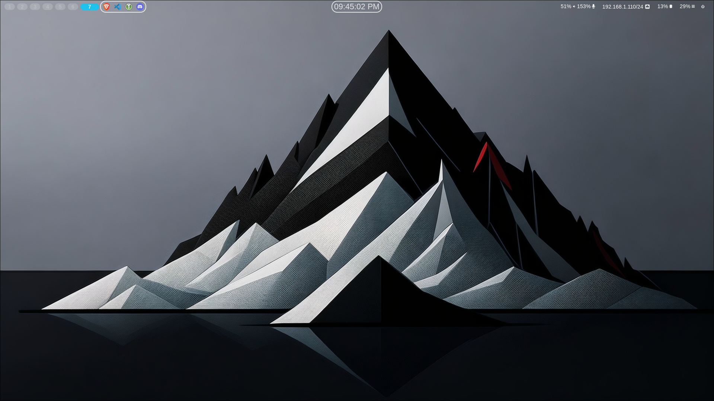

[]()
<p align="center"></a> 
<br> Created in Arch Linux with Hyprland. </br>
<i> The only UI you'll ever need! 😺 </i>
</p>

## What is Artx? 🤔
Artx is a distro ricing made for ArchLinux which basically affects the UI by WM [Hyprland](https://github.com/hyprwm/Hyprland), granting the user the best experience possible in Wayland.
## 📦 Programs

List of programs and tools I use.

| Component         | Program    |
|-------------------|------------|
| Windows Manager 🪟| [hyprland](https://github.com/hyprwm/Hyprland)  |
| Terminal 🖥️       | [kitty](https://github.com/kovidgoyal/kitty)        |
| Shell 🐚          | [fish](https://fishshell.com/) / [omf](https://github.com/oh-my-fish/oh-my-fish) |
| File Manager 📁   | [dolphin](https://apps.kde.org/dolphin/)/[ranger](https://github.com/ranger/ranger)      |
| Editor 📝         | [neovim](https://github.com/neovim/neovim) / [vs-code](https://code.visualstudio.com/)     |
|   IDE 📦            |   [Intellij](https://www.jetbrains.com/idea/)    |
| Browser 🌐        | [brave](https://brave.com/) / [librewolf](https://librewolf.net/) |
| Bar 📊            | [waybar](https://github.com/Alexays/Waybar)      |
| Launcher 🚀       | [rofi](https://github.com/davatorium/rofi)          |
| Color Theme 🎨    | [nwg-loock](https://github.com/nwg-piotr/nwg-look) |
| Lockscreen 🔒     | [swaylock](https://github.com/hyprwm/hyprlock)  |
| Login Menu 🚪     | [sddm](https://github.com/sddm/sddm)          |
| Music Player 🎵   | [spotify](https://aur.archlinux.org/packages/spotify-adblock)      |
| Visualiser 📊     | [vis](https://github.com/dpayne/cli-visualizer)          |
| Pomodoro 🍅       | [tomato-c](https://github.com/gabrielzschmitz/Tomato.C)      |
| Others 🌱         | [cbonsai](https://github.com/mhzawadi/homebrew-cbonsai) |


## 🖼️ Previews 


## All package you need
hyprland, wayland, dolphin, eww, fish, gcolor3, hyperpiker, kitty, kvantum, nvidia-dkms, nwg-look, papirus-icon-theme, pavucontroll, polkit-kde-agent, Qt5-graphicaleffects, Qt5-imageformats, Qt5ct, Qt6ct, rofi-wayland, rofimoji, swaylock-effects, swww, waybar, wireplump, wlogout, swappy, vscode
### Arch - paru AUR
```
paru -S hyprland wayland dolphin eww-git fish gcolor3 hyperpiker kitty kvantum nvidia-dkms nwg-look papirus-icon-theme pavucontroll polkit-kde-agent qt5-graphicaleffects qt5-imageformats qt5ct qt6ct rofi-wayland rofimoji swaylock-effects swww waybar wlogout wireplump visual-studio-code-bin

```

## 📝 Credits
- Readmi.md file Design: [iXiuny](https://github.com/iXiuny/Artx)
- sddm-theme - sddm theme from [sddm-flower-theme](https://github.com/Keyitdev/sddm-flower-theme)

## 📸 More Screenshots
### Desktop 🖥️
[]()
**Artx aims for a minimalist ui, designed to help the user focus on his duty** 🎆
[]()
**The topbar it's designed to avoid taking too much space of your screen, matter of facts, it's fragmented in different parts of it, giving it style and efficency 🧰**
### Console 👩‍💻👨‍💻
[]()
**Tired of the typical console design? No worries! Artx added a design the console aswell! and you can even keep order of your console processes!**

### Search Bar 🔎
[]()
**Ever wanted a clean search bar? Don't worry, Artx it's here for you. Artx offers a super clean search bar without any useless details**
### Folder 📁
[]()
**The folder UI it's pretty simple, it just displays the main folders and the disks at the bottom to help you understand how much space you have left!**
### Music 🎵🎼
[]()
**Artx lets you visualize the db level of what you are listening to, this might help you to find the best volume settings for music! 😃**
### Emojis 😂 and Fonts 字体
[]()
**Imagine you are texting a friend and you cannot find an emoji or writing a readme.md file, thanks to Artx there is a Emojibar for you to choose faster! 🥰**
### Logout 👨‍💻⏻
[]()
**The logout it's similiar to a phone shutdown, this is basically a designing choice, nothing too special 🤔**

### SDDM 👨‍💻﫻
[]()